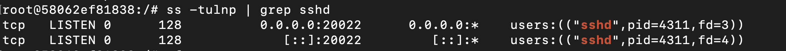
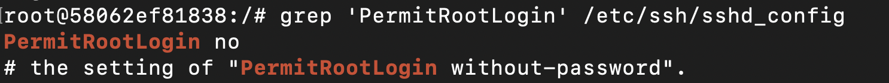
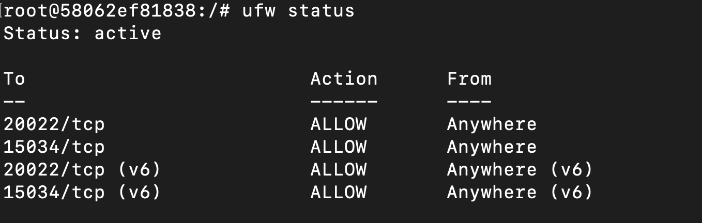
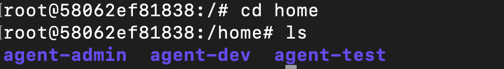
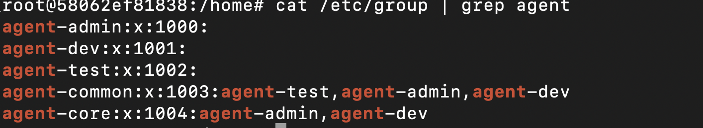
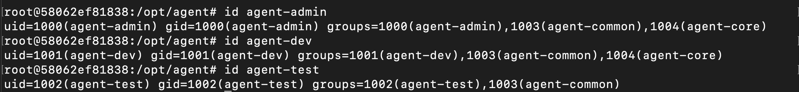
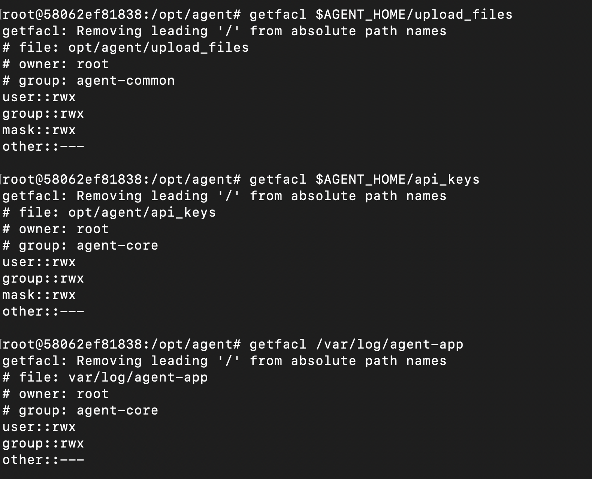
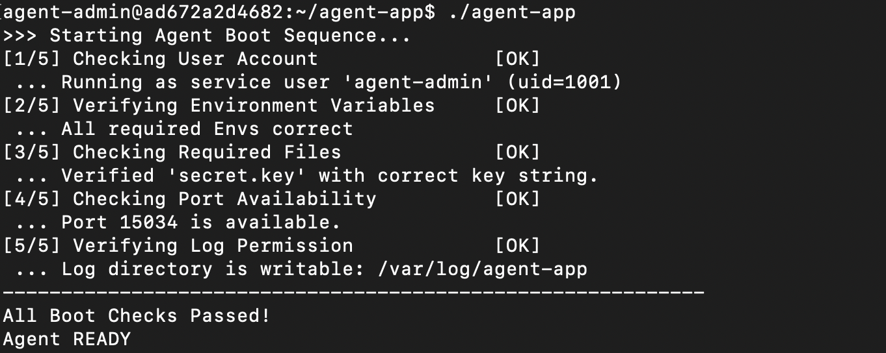

# 1. 기능 보안 및 네트워크 설정
`docker run -dit --name server --init --cap-add NET_ADMIN --cap-add NET_RAW -p 15034:15034 ubuntu:noble /bin/bash`
 
` apt-get update`

`apt-get install -y openssh-server ufw`

`apt-get install -y iproute2`

실습에 용이한 22.04 버전으로 리눅스 서버를 구축 

최신 패키지를 다운

SSH, ufw 프로그램 설치
```bash
which sshd
/usr/sbin/sshd

which ufw
/usr/sbin/ufw
```
# 1-1. SSH 설정
#   포트 변경 / 원격 로그인 차단

1) 비활성화된 '포트22'를 활성화된 '포트20022'로 변경
```bash
cat /etc/ssh/sshd_config

# This is the sshd server system-wide configuration file.  See
# sshd_config(5) for more information.

# This sshd was compiled with PATH=/usr/local/sbin:/usr/local/bin:/usr/sbin:/usr/bin:/sbin:/bin:/usr/games

# The strategy used for options in the default sshd_config shipped with
# OpenSSH is to specify options with their default value where
# possible, but leave them commented.  Uncommented options override the
# default value.

Include /etc/ssh/sshd_config.d/*.conf

#Port 22
```
비활성화 된 22포트 확인


`root@58062ef81838:/# sed -i 's/#Port 22/Port 20022/' /etc/ssh/sshd_config`

포트 변경
```bash
grep '^Port' /etc/ssh/sshd_config
Port 20022
```
활성화 및 20022 포트로 변경 

```bash
 service ssh restart 

 * Restarting OpenBSD Secure Shell server sshd


 ss -tulnp | grep sshd

tcp   LISTEN 0      128          0.0.0.0:20022      0.0.0.0:*    users:(("sshd",pid=4311,fd=3))
tcp   LISTEN 0      128             [::]:20022         [::]:*    users:(("sshd",pid=4311,fd=4))

```
| 캡쳐 




--


2) ROOT 원격 로그인 차단

```bash
grep 'PermitRootLogin' /etc/ssh/sshd_config
#PermitRootLogin prohibit-password
# the setting of "PermitRootLogin without-password".
```
Root 원격 로그인 차단 비활성화
현재 설정 prohibit-password : 비밀번호 사용한 원격 로그인 차단

```bash
sed -i 's/#PermitRootLogin prohibit-password/
PermitRootLogin no/' /etc/ssh/sshd_config

grep 'PermitRootLogin' /etc/ssh/sshd_config

PermitRootLogin no
# the setting of "PermitRootLogin without-password".
```
Root 원격 로그인 차단 활성화
설정 변경 no : 원격 로그인 차단

|캡쳐



# 
# 1-2. 방화벽 설정 (ufw 선택)

1) 방화벽 상태 확인
```bash
ufw status

Status: inactive
```
비활성화 된 방화벽 확인

2) 방화벽 설정 (인바운드 / 아웃바운드)

```bash
ufw default deny incoming

Default incoming policy changed to 'deny'
(be sure to update your rules accordingly)

ufw default allow outgoing

Default outgoing policy changed to 'allow'
(be sure to update your rules accordingly)
```

3) 인바운드 허용 포트 설정
```bash
ufw allow 20022/tcp

Rules updated
Rules updated (v6)


ufw allow 15034/tcp

Rules updated
Rules updated (v6)
```

4) 방화벽 활성화 및 상태 확인
```bash
ufw enable

Firewall is active and enabled on system startup


ufw status

Status: active
To                         Action      From
--                         ------      ----
20022/tcp                  ALLOW       Anywhere                  
15034/tcp                  ALLOW       Anywhere                  
20022/tcp (v6)             ALLOW       Anywhere (v6)             
15034/tcp (v6)             ALLOW       Anywhere (v6)     
```

| 캡쳐


#
#

# 2. 계정/ 그룹 / 권한체계 (협업 + 최소 권한)

# 2-1. 생성 계정

dir home 에 생성

1) agent-admin 계정 
```bash
useradd -m -s /bin/bash agent-admin


echo 'agent-admin:Admin1234!' | chpasswd


id agent-admin

uid=1000(agent-admin) gid=1000(agent-admin) groups=1000(agent-admin)
```

2) agent-dev 계정
```bash
useradd -m -s /bin/bash agent-dev  


echo 'agent-dev:Dev1234!' | chpasswd


id agent-dev

uid=1001(agent-dev) gid=1001(agent-dev) groups=1001(agent-dev)
```

3) agent-test
```bash
useradd -m -s /bin/bash agent-test


echo 'agent-test:Test1234!' | chpasswd


id agent-test

uid=1002(agent-test) gid=1002(agent-test) groups=1002(agent-test)
```
|캡쳐


#
# 2-2. 생성 그룹

1) agent-common 그룹 생성 (admin, dev, test)
```bash
groupadd agent-common


cat /etc/group | grep agent

agent-admin:x:1000:
agent-dev:x:1001:
agent-test:x:1002:
agent-common:x:1003:
```
2) 계정들 그룹에 추가

`usermod -aG agent-common agent-admin`
```bash
for user in  agent-dev agent-test; do usermod -aG agent-common $user; done


cat /etc/group | grep agent

agent-admin:x:1000:
agent-dev:x:1001:
agent-test:x:1002:
agent-common:x:1003:agent-test,agent-admin,agent-dev
```

3) agent-core 그룹 생성 (admin, dev) 후 계정 추가
```bash
groupadd agent-core


for user in agent-admin agent-dev; do usermod -aG agent-core $user; done


cat /etc/group | grep agent

agent-admin:x:1000:
agent-dev:x:1001:
agent-test:x:1002:
agent-common:x:1003:agent-test,agent-admin,agent-dev
agent-core:x:1004:agent-admin,agent-dev
```

|캡쳐



#
# 2-3. 디렉토리 구조

1) 환경 변수 설정 
`exoprt AGENT_HOME=/opt/agent`

AGENT_HOME 이라는 변수에 /opt/agent (경로) 입력

2) 환경 변수를 활용하여 dir 설정
```bash
mkdir $AGENT_HOME/api_keys


mkdir $AGENT_HOME/upload_files


mkdir /var/log/agent-app

/opt/agent# ls

api_keys  upload_files
```

#
# 2-4. 권한 설정

디렉토리에서 실행권한(x)는 필수적

x: 디렉토리 들어가는 것을 의미    (rw-:사실상 --- 과 같은 느낌)

1) upload_files : agent-common (RW)
```bash
chown root:agent-common $AGENT_HOME/upload_files


chmod 770 $AGENT_HOME/upload_files


getfacl $AGENT_HOME/upload_files

getfacl: Removing leading '/' from absolute path names
# file: opt/agent/upload_files
# owner: root
# group: agent-common
user::rwx
group::rwx
mask::rwx
other::---
```


2) api_keys & /var/log/agent-app :agent-core (RW)
```bash
for dir in $AGENT_HOME/api_keys /var/log/agent-app; do chown root:agent-core $dir ; done


getfacl $AGENT_HOME/api_keys

getfacl: Removing leading '/' from absolute path names
# file: opt/agent/api_keys
# owner: root
# group: agent-core
user::rwx
group::rwx
mask::rwx
other::---


getfacl /var/log/agent-app

getfacl: Removing leading '/' from absolute path names
# file: var/log/agent-app
# owner: root
# group: agent-core
user::rwx
group::rwx
other::---
```

|캡쳐 
 

#
#
# 3. 애플리케이션 실행 환경 구성
# 3-1. 환경 변수

1) 앱 실행 환경 설정

필수적 환경 변수들
```bash
export AGENT_HOME=/home/agent-admin/agent-app

export AGENT_PORT=15034

export AGGENT_UPLOAD_DIR=$AGENT_HOME/upload_files

export AGENT_KEY_PATH=$AGENT_HOME/api_keys/t_secret.key
```

기본값 지정
(미지정 하여도 앱 돌아감, 대신 앱 코드 기본값에 따라 log가 쌓임)

앱의 기본값이 무엇인지 모르니까 미리 지정하는 것
```bash
export AGENT_LOG_DIR=/var/log/agent-app
```

#
# 3-2. 키 파일 생성

앱 실행을 위한 인증키(문자열) 생성

```bash
mkdir -p $AGENT_HOME/api_keys


echo 'agent_api_key_test' > $AGENT_KEY_PATH 

cat $AGENT_KEY_PATH
```

#
# 3-3. 앱 실행 및 성공 기준
1) agent-app 다운 받기 
```bash
#로컬pc 파일을 컨테이너로 옮기기
dave1392857@c4r8s7 ~ % docker cp ~/Downloads/agent-app ad672a2d4682:/home/agent-admin/agent-app/

Successfully copied 7.93MB to ad672a2d4682:/home/agent-admin/agent-app/
```

2) agent-app 사용자 변경

로컬pc에서 건너왔기 때문에 로컬 사용자가 user

컨테이너 안에서 새롭게 user를 정의해 주어야 한다.

```bash
#agent-admin(일반 계정)으로 앱 실행할 것이기에 user= agent-admin

dave1392857@c4r8s7: docker exec -it server bash

root@ad672a2d4682: 
export AGENT_HOME=/home/agent-admin/agent-app


chown agent-admin:agent-admin $AGENT_HOME/agent-app


ls -l $AGENT_HOME/agent-app

-rw-rw-r-- 1 agent-admin agent-admin 7926296 Jan 29 10:36 /home/agent-admin/agent-app/agent-app
```

3) agent-app 실행
```bash
#agent-admin 계정이 user가 되었기에 x(실행) 권한 부여 가능

export AGENT_HOME=/home/agent-admin/agent-app

export AGENT_PORT=15034

export AGENT_UPLOAD_DIR=$AGENT_HOME/upload_files

export AGENT_KEY_PATH=$AGENT_HOME/api_keys


export AGENT_LOG_DIR=/var/log/agent-app
#root > agent-admin 으로 계정 바뀌었으니까 다시 환경변수 설정

chmod +x $AGENT_HOME/agent-app


ls -l $AGENT_HOME/agent-app

-rwxrwxr-x 1 agent-admin agent-admin 7926296 Jan 29 10:36 /home/agent-admin/agent-app/agent-app


#앱 실행
agent-admin@ad672a2d4682:~$ cd $AGENT_HOME


agent-admin@ad672a2d4682:~/agent-app$ ./agent-app

>>> Starting Agent Boot Sequence...
[1/5] Checking User Account               [OK]
 ... Running as service user 'agent-admin' (uid=1001)
[2/5] Verifying Environment Variables     [OK]
 ... All required Envs correct
[3/5] Checking Required Files             [OK]
 ... Verified 'secret.key' with correct key string.
[4/5] Checking Port Availability          [OK]
 ... Port 15034 is available.
[5/5] Verifying Log Permission            [OK]
 ... Log directory is writable: /var/log/agent-app
------------------------------------------------------------
All Boot Checks Passed!
Agent READY
```
|캡쳐



#
#
# 4. 시스템 관제 자동화 스크립트(monitor.sh) 구현


# 4-1 파일 위치/권한 정책
1) monitor.sh 경로 및 권한 설정


#바이너리 파일 실행(admin) >> 권한 설정 (root)
`root@600fd0b17301:/home export AGENT_HOME=/home/agent-admin/agent-app`

```bash
#파일 생성
mkdir -p $AGENT_HOME/bin


touch $AGENT_HOME/bin/monitor.sh


# 확인
/home/agent-admin/agent-app/bin ls

monitor.sh
```
```bash
#권한 설정
chown agent-dev:agent-core $AGENT_HOME/bin/monitor.sh


chmod 750 $AGENT_HOME/bin/monitor.sh


#확인
ls -l $AGENT_HOME/bin/monitor.sh

-rwxr-x--- 1 agent-dev agent-core 0 May 21 23:19 /home/agent-admin/agent-app/bin/monitor.sh
```

2) cron 설치 및 편집
```bash
#1. cron 설치
apt-get install -y cron


apt-get install -y nano
(cron 편집에 사용)

#2. cron 실행
service cron start

 * Starting periodic command scheduler cron 


service cron status

 * cron is running
```
```bash
#3. cron 편집 
crontab -u agent-admin -e

<nano editor>
*/1 * * * * /home/agent-admin/agent-app/bin/monitor.sh >> /var/log/agent-app/monitor.log 2>&1


crontab -u agent-admin -l

# Edit this file to introduce tasks to be run by cron.
# 
# Each task to run has to be defined through a single line
# indicating with different fields when the task will be run
# and what command to run for the task
# 
# To define the time you can provide concrete values for
# minute (m), hour (h), day of month (dom), month (mon),
# and day of week (dow) or use '*' in these fields (for 'any').
# 
# Notice that tasks will be started based on the cron's system
# daemon's notion of time and timezones.
# 
# Output of the crontab jobs (including errors) is sent through
# email to the user the crontab file belongs to (unless redirected).
# 
# For example, you can run a backup of all your user accounts
# at 5 a.m every week with:
# 0 5 * * 1 tar -zcf /var/backups/home.tgz /home/
# 
# For more information see the manual pages of crontab(5) and cron(8)
# 
# m h  dom mon dow   command
*/1 * * * * /home/agent-admin/agent-app/bin/monitor.sh >> /var/log/agent-app/monitor.log 2>&1
```

#
# 4-2. Health Check (실패 시 종료)

1) 바이너리 백그라운드 실행

`agent-admin@600fd0b17301:cd ~/agent-app/agent-app` 

`./agent-app-linux-x86 > /dev/null 2>&1 &`

2) 프로세스 확인
```bash
pgrep -f agent-app-linux-x86

4758 #메인 pid
4760 #쎄컨 pid
```

3) 포트 확인
```bash
ss -tlnp | grep 15034

LISTEN 0      1            0.0.0.0:15034      0.0.0.0:* 
```

4) Health Check 스크립트 작성
```bash
nano $AGENT_HOME/bin/monitor.sh

>> nano enter 

#!/bin/bash

# =====================
# Health Check
# =====================

# 1. 프로세스 확인
if ! pgrep -f "agent-app-linux-x86" > /dev/null 2>&1; then
    echo "[ERROR] agent-app process is not running"
    exit 1
fi

# 2. 포트 확인
if ! ss -tlnp | grep -q ":15034"; then
    echo "[ERROR] Port 15034 is not listening"
    exit 1
fi

echo "[OK] Health Check Passed"

>> ^c + x + enter

cat $AGENT_HOME/bin/monitor.sh
```
```
#!/bin/bash

# =====================
# Health Check
# =====================

# 1. 프로세스 확인
if ! pgrep -f "agent-app-linux-x86" > /dev/null 2>&1; then
    echo "[ERROR] agent-app process is not running"
    exit 1
fi

# 2. 포트 확인
if ! ss -tlnp | grep -q ":15034"; then
    echo "[ERROR] Port 15034 is not listening"
    exit 1
fi

echo "[OK] Health Check Passed"
```

5) 실행 확인
```bash
bash $AGENT_HOME/bin/monitor.sh

tail -f /var/log/agent-app/monitor.log

[OK] Health Check Passed
[OK] Health Check Passed
[OK] Health Check Passed

#파일 종료 후
cat /var/log/agent-app/monitor.log

[OK] Health Check Passed
[OK] Health Check Passed
[OK] Health Check Passed
[OK] Health Check Passed
[OK] Health Check Passed
[ERROR] agent-app process is not running
[ERROR] agent-app process is not running
[ERROR] agent-app process is not running
```